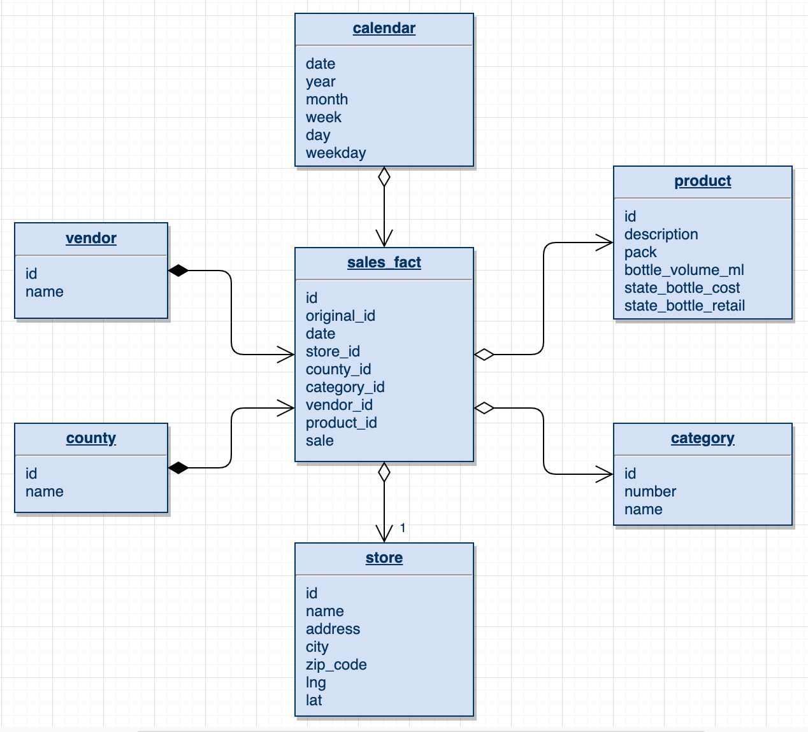

# UDACITY DEND - Capstone Project

## Introduction

Here is the final project for the Udacity Data Engineer NanoDegree.

For simplicity of sharing the project with the need to setup the less services on the cloud I decided to do this project thanks to [Google Collab Notebook](https://colab.research.google.com/notebooks/welcome.ipynb#recent=true) (Online Jupyter Notebook with GPU for free).
I use a local session of Spark but you need to setup some AWS services :

* AWS IAM User with AmazonS3FullAccess permission
* S3 bucket URL
* Google Map API Key

You are guided all along with this notebook that you can find here :

https://colab.research.google.com/drive/18v5oG_lFUvaHzBfYfIQIIRtL3E1u8Uxa

You can save your own copy on your drive if you have permission issue to launch this project.

Additionally you will find a `.ipynb` file with the ful project if you prefer to run it locally
> You need to change, in this case, the method to upload the .csv file for the AWS credential.
> You also need a local installation of Spark or setup a cluster on the cloud and the setup code accordingly

## Project summary
This project use a slightly modified version of the Iowa Liquor Sales from Kaggle (more info in the Collab Notebook).
The goal is to ETL this file of 3.5Go into a schema more suitable for data analysis. From a flat file to a star schema, ready to be consume for a Data Analyst or a Data Scientist.

You can find a data dictionary in this repository in an Open Source format to make it available for everyone.

The focus will be on the sales with the ability to slice/dice the data in different dimension like depending of the vendor, the location, date...

## Choice of technology
The dataset is too big to be wrangle by pandas only but don't need a big Hadoop cluster either. That's why I choose to use spark locally with all the core available on the system.

## Future proof scenario
Even if this dataset is big, it cannot be labelled as Big Data. If I had 100x times the Go I would have to set up a real Spark cluster like with AWS EMR.

Also this data set is a one time file, but in a real case with data that would come every day from report I would setup a daily workflow with AirFlow and split all the logic included in this notebook in several task in a `@daily` DAG.

A real Hadoop cluster with Spark SQL on top would be also a good fit if 100 persons in a company had to work with the data since it would scale automatically depending of the CPU consumption.